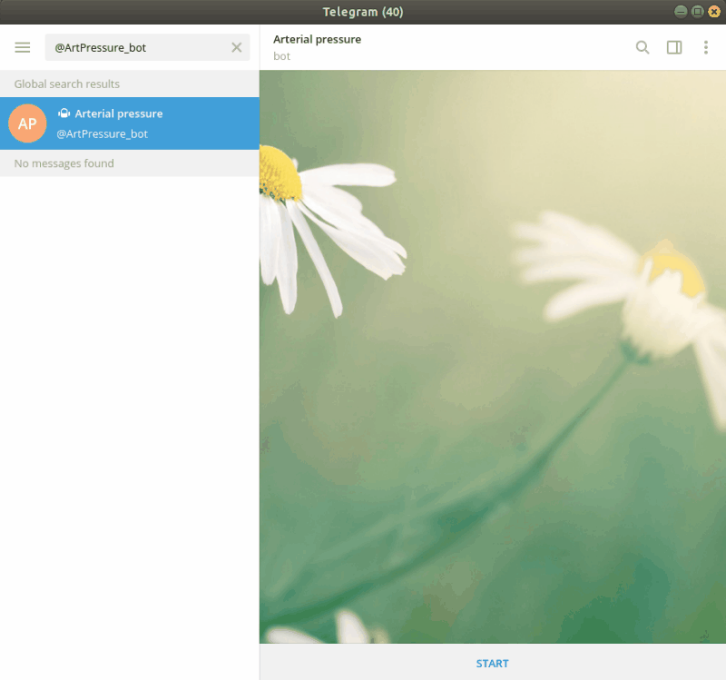

# Telegram Arterial pressure bot. V.1.0 

### @ArtPressure_bot
#### <https://t.me/ArtPressure_bot>
-------------
The bot was created when I started my way with python.  
I can see architecture and other limitations in code,
but decided to save it,  
because it provides me an oportunity to measure and assess my progress through time.  

Pressure bot collects arterial pressure data and makes graphs.  
It also reminds when it's time to measure pressure and makes recommendation about health.

March 2020: added GitHub actions, Docker file and server.sh

## Usage
To use the bot you need to install telegram and add @ArtPressure_bot to your contacts.

You can start the app on your machine:
- `pip3 install -r requirements.txt`
- add env variables to `server_example.sh` and start it 

Also you can build image with docker and start it:
- `docker build -t . bot`
- `docker run bot`  

## Contributing
As I use this for my own projects, I know this might not be the perfect approach for all the projects out there. If you have any ideas, just open an issue and tell me what you think.

If you'd like to contribute, please fork the repository and make changes as you'd like. Pull requests are warmly welcome.

## DEMO

## Licensing
This project is licensed under BSD-3 license. This license allows unlimited redistribution for any purpose as long as its copyright notices and the license's disclaimers of warranty are maintained. 

## Contacts
Facebook: <https://www.facebook.com/maria.kuznetsova.1048>

Email: <mary@filonova.dev>
